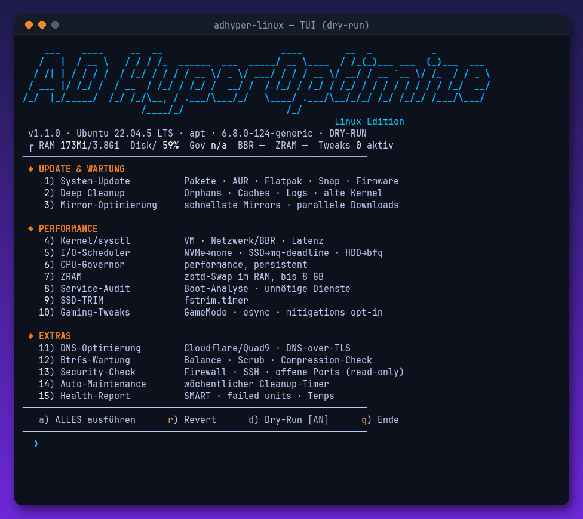

<div align="center">

# ⚡ AD HyperOptimize — Linux Edition

**Deep system update, cleanup & performance tuning. One script, zero dependencies, fully revertible.**

[](https://github.com/zCrxticxl/adhyper-linux/stargazers)
[](LICENSE)
[](adhyper-linux.sh)




<sup>Real recording — TUI in dry-run mode: kernel/sysctl tuning preview & security check</sup>

</div>

---

## 🚀 Quick start

```bash
git clone https://github.com/zCrxticxl/adhyper-linux.git
cd adhyper-linux && chmod +x adhyper-linux.sh

sudo ./adhyper-linux.sh              # interactive TUI
sudo ./adhyper-linux.sh --dry-run    # preview everything, change nothing
sudo ./adhyper-linux.sh --all        # run all core modules non-interactively
sudo ./adhyper-linux.sh --revert     # undo ALL tweaks
```

Distro auto-detected via `os-release` — **Arch** (+ CachyOS, EndeavourOS, Manjaro), **Debian/Ubuntu** (+ Mint, Pop!\_OS), **Fedora** (+ Nobara), **openSUSE**.

## 🧩 15 modules

| # | Module | What it does |
|---|--------|--------------|
| 1 | 📦 System-Update | Package manager + AUR + Flatpak + Snap + firmware (fwupd) |
| 2 | 🧹 Deep Cleanup | Orphans, package caches, journal, coredumps, old kernels, snap revisions, thumbnails |
| 3 | 🌍 Mirror Optimization | reflector (Arch), parallel downloads (pacman/dnf), fastest mirror |
| 4 | 🧠 Kernel/sysctl | swappiness (ZRAM-aware), absolute dirty limits, BBR + fq, latency & inotify tuning |
| 5 | 💾 I/O Scheduler | udev rules: NVMe→none, SSD→mq-deadline, HDD→bfq + read-ahead |
| 6 | ⚙️ CPU Governor | performance governor + EPP, persisted via systemd service, laptop-aware |
| 7 | 🗜️ ZRAM | zram-generator, zstd, min(ram, 8G) |
| 8 | 🔍 Service Audit | boot analysis, interactive disabling of unneeded services |
| 9 | ✂️ SSD TRIM | fstrim.timer + immediate trim |
| 10 | 🎮 Gaming | GameMode, esync nofile limits, `mitigations=off` (explicit opt-in only) |
| 11 | 🌐 DNS | Cloudflare/Quad9 with DNS-over-TLS via systemd-resolved |
| 12 | 🌳 Btrfs Maintenance | balance, scrub, scrub timer, compression hints |
| 13 | 🛡️ Security Check | firewall, SSH config, listening ports, auto-update status (read-only) |
| 14 | 🔁 Auto-Maintenance | weekly systemd timer running cleanup automatically |
| 15 | 🩺 Health Report | SMART, failed units, journal errors, temperatures, active tweaks |

## 🛟 Safety

- **Dry-run mode** (`--dry-run` or toggle `d` in the menu) shows every command and config file without executing anything — that's what the GIF above shows.
- Every created or modified file is tracked in `/etc/adhyper-backup/`. **`--revert` restores originals**, removes created files and re-enables disabled services.
- Risky options (`mitigations=off`, DNS change, disabling bluetooth/cups) always require explicit interactive confirmation — **never** applied by `--all`.
- **No snake oil:** no `drop_caches` "RAM cleaners", no preload, no placebo tweaks.

## 📋 Requirements

`bash` ≥ 4, systemd, root (script self-elevates via sudo). Log: `/var/log/adhyper-optimize.log`.

## ⚠️ Disclaimer

Use at your own risk. Read the dry-run output before applying. `mitigations=off` disables CPU vulnerability mitigations — only for machines without sensitive data.

---

<div align="center">
<sub>⭐ if this sped up your boot — by <a href="https://github.com/zCrxticxl">Adrian (zCrxticxl)</a> · Windows version: <a href="https://github.com/zCrxticxl/ad-hyperoptimize">ad-hyperoptimize</a> · desktop theming: <a href="https://github.com/zCrxticxl/adrice">adrice</a></sub>
</div>
