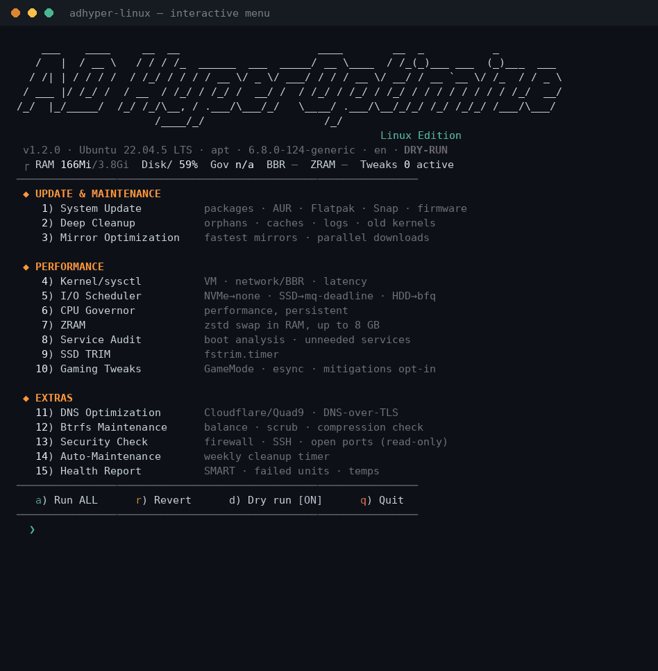

# AD HyperOptimize — Linux Edition



Deep system update, cleanup & performance tuning for Linux. One script, zero dependencies, fully revertible. **Bilingual** — English/German UI, auto-detected from `$LANG` (override with `--lang=de|en`).

Supports **Arch** (+ CachyOS, EndeavourOS, Manjaro), **Debian/Ubuntu** (+ Mint, Pop!_OS), **Fedora** (+ Nobara) and **openSUSE** — auto-detected via `os-release`.

```
sudo ./adhyper-linux.sh              # interactive TUI
sudo ./adhyper-linux.sh --dry-run    # preview everything, change nothing
sudo ./adhyper-linux.sh --all        # run all core modules non-interactively
sudo ./adhyper-linux.sh --revert     # undo ALL tweaks
sudo ./adhyper-linux.sh --lang=en    # force English UI
```

## Modules

| # | Module | What it does |
|---|--------|--------------|
| 1 | System-Update | Package manager + AUR + Flatpak + Snap + firmware (fwupd) |
| 2 | Deep Cleanup | Orphans, package caches, journal, coredumps, old kernels, snap revisions, thumbnails |
| 3 | Mirror Optimization | reflector (Arch), parallel downloads (pacman/dnf), fastest mirror |
| 4 | Kernel/sysctl | swappiness (ZRAM-aware), absolute dirty limits, BBR + fq, latency & inotify tuning |
| 5 | I/O Scheduler | udev rules: NVMe→none, SSD→mq-deadline, HDD→bfq + read-ahead |
| 6 | CPU Governor | performance governor + EPP, persisted via systemd service, laptop-aware |
| 7 | ZRAM | zram-generator, zstd, min(ram, 8G) |
| 8 | Service Audit | boot analysis, interactive disabling of unneeded services |
| 9 | SSD TRIM | fstrim.timer + immediate trim |
| 10 | Gaming | GameMode, esync nofile limits, `mitigations=off` (explicit opt-in only) |
| 11 | DNS | Cloudflare/Quad9 with DNS-over-TLS via systemd-resolved |
| 12 | Btrfs Maintenance | balance, scrub, scrub timer, compression hints |
| 13 | Security Check | firewall, SSH config, listening ports, auto-update status (read-only) |
| 14 | Auto-Maintenance | weekly systemd timer running cleanup automatically |
| 15 | Health Report | SMART, failed units, journal errors, temperatures, active tweaks |

## Safety

- **Dry-run mode** (`--dry-run` or toggle `d` in the menu) shows every command and config file without executing anything.
- Every file the script creates or modifies is tracked in `/etc/adhyper-backup/`. `--revert` restores originals, removes created files and re-enables disabled services.
- Risky options (`mitigations=off`, DNS change, disabling bluetooth/cups) always require explicit interactive confirmation — they are **never** applied by `--all`.
- No snakeoil: no `drop_caches` "RAM cleaners", no preload, no placebo tweaks.

## Requirements

- bash ≥ 4, systemd, root (script self-elevates via sudo)
- Log: `/var/log/adhyper-optimize.log`

## Disclaimer

Use at your own risk. Read the dry-run output before applying. `mitigations=off` disables CPU vulnerability mitigations — only for machines without sensitive data.
